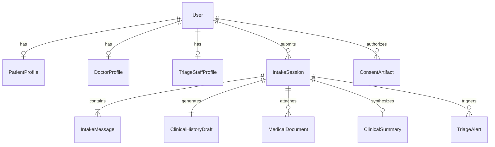

# MediKiosk Data Model Specification

## Entity Relationship Overview

---

## 1. App: `accounts`

### `accounts.User` (extends `AbstractUser`)
- `role`: CharField (Choices: `PATIENT`, `DOCTOR`, `TRIAGE_STAFF`, `ADMIN`)
- Standard Django fields (`username`, `email`, `password`, `is_staff`, `date_joined`)

### `accounts.PatientProfile`
- `user`: OneToOneField(`User`, related_name=`patient_profile`)
- `name`: CharField(150)
- `age`: PositiveIntegerField(null=True)
- `gender`: CharField(choices=[`MALE`, `FEMALE`, `OTHER`])
- `phone`: CharField(20, db_index=True)
- `preferred_language`: CharField(20, default='en')
- `mock_abha_id`: CharField(64, unique=True, null=True, help_text="Mock 14-digit ABHA ID, e.g. 14-8921-3490-1284")
- `created_at`, `updated_at`: DateTimeField

### `accounts.DoctorProfile`
- `user`: OneToOneField(`User`, related_name=`doctor_profile`)
- `name`: CharField(150)
- `department`: CharField(100, default='General Medicine')
- `specialization`: CharField(100, default='Consultant Physician')
- `room_number`: CharField(20, default='Room 3')

### `accounts.TriageStaffProfile`
- `user`: OneToOneField(`User`, related_name=`triage_staff_profile`)
- `name`: CharField(150)
- `station_id`: CharField(50, default='Kiosk Station 01')
- `shift`: CharField(50)

---

## 2. App: `intake` (Module A)

### `intake.IntakeSession`
- `session_id`: CharField(64, unique=True, db_index=True)
- `patient`: ForeignKey(`User`, null=True, blank=True)
- `patient_identifier`: CharField(64, default='MK-78294')
- `doctor`: ForeignKey(`User`, null=True, blank=True)
- `department`: CharField(100, default='General Medicine')
- `status`: CharField(choices=[`IN_PROGRESS`, `COMPLETED`, `ABANDONED`])
- `language`: CharField(20, default='en')
- `is_ayush_enabled`: BooleanField(default=False)
- `flagged`: BooleanField(default=False, db_index=True)
- `flag_reason`: CharField(255, blank=True)
- `progress_percent`: PositiveIntegerField(default=10)
- `current_stage`: CharField(choices=[`CHIEF_COMPLAINT`, `HPI`, `PAST_HISTORY`, `DRUG_ALLERGY`, `FAMILY_PERSONAL`, `AYUSH`, `COMPLETE`])
- `started_at`, `completed_at`: DateTimeField

### `intake.IntakeMessage`
- `session`: ForeignKey(`IntakeSession`, related_name=`messages`)
- `sender`: CharField(choices=[`patient`, `ai`, `system`])
- `text`: TextField
- `input_mode`: CharField(choices=[`voice`, `touch`, `text`])
- `suggested_answers`: JSONField(default=list)
- `extracted_entities`: JSONField(default=dict)
- `timestamp`: DateTimeField(auto_now_add=True)

### `intake.ClinicalHistoryDraft`
- `session`: OneToOneField(`IntakeSession`, related_name=`clinical_draft`)
- `chief_complaint`: TextField(blank=True)
- `hpi`: JSONField(default=dict) (SOCRATES: site, onset, character, radiation, associations, time_course, severity)
- `past_medical_history`: JSONField(default=list)
- `drug_history`: JSONField(default=list)
- `allergies`: JSONField(default=list)
- `family_history`: JSONField(default=list)
- `personal_history`: JSONField(default=dict)
- `ayush_fields`: JSONField(default=dict) (prakriti, agni, koshtha, ahara_vihara)
- `updated_at`: DateTimeField(auto_now=True)

---

## 3. App: `documents` (Module B)

### `documents.MedicalDocument`
- `doc_id`: CharField(64, unique=True)
- `patient`: ForeignKey(`User`, null=True)
- `session`: ForeignKey(`IntakeSession`, null=True)
- `title`: CharField(255)
- `doc_type`: CharField(choices=[`PRESCRIPTION`, `LAB_REPORT`, `DISCHARGE_SUMMARY`, `OTHER`])
- `ocr_status`: CharField(choices=[`PENDING`, `PROCESSING`, `COMPLETED`, `FAILED`])
- `raw_text`: TextField
- `extracted_entities`: JSONField(default=dict)
- `celery_task_id`: CharField(128, null=True)

---

## 4. App: `summary` (Module C)

### `summary.ClinicalSummary`
- `summary_id`: CharField(64, unique=True)
- `patient`: ForeignKey(`User`, null=True)
- `session`: ForeignKey(`IntakeSession`, null=True)
- `status`: CharField(choices=[`GENERATING`, `READY`, `DOCTOR_EDITED`])
- `chief_complaints`: JSONField(default=list)
- `history_of_present_illness`: TextField
- `allergies`: JSONField(default=list)
- `current_medications`: JSONField(default=list)
- `vitals`: JSONField(default=dict)
- `doctor_notes`: TextField(blank=True)

---

## 5. App: `triage`

### `triage.TriageAlert`
- `alert_id`: CharField(64, unique=True)
- `patient`: ForeignKey(`User`, null=True)
- `session`: ForeignKey(`IntakeSession`, null=True)
- `severity`: CharField(choices=[`LOW`, `MEDIUM`, `HIGH`, `CRITICAL`])
- `category`: CharField(choices=[`CARDIOVASCULAR`, `RESPIRATORY`, `NEUROLOGICAL`, `DRUG_CONTRAINDICATION`, `OTHER`])
- `trigger_reason`: CharField(255)
- `is_resolved`: BooleanField(default=False)
- `resolved_by`: ForeignKey(`User`, null=True)

---

## 6. App: `consent` (Module D)

### `consent.ConsentArtifact`
- `consent_id`: CharField(64, unique=True)
- `patient`: ForeignKey(`User`, null=True)
- `purpose`: CharField(choices=[`CARE_CONSULTATION`, `RECORD_SHARING`, `AI_PROCESSING`])
- `status`: CharField(choices=[`GRANTED`, `REVOKED`, `EXPIRED`])
- `hip_id`, `hiu_id`: CharField(64)
- `mock_fhir_bundle`: JSONField(default=dict)
